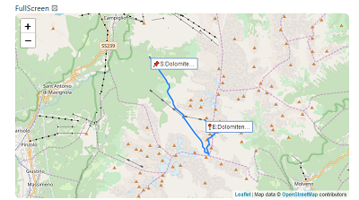
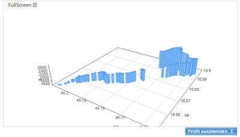
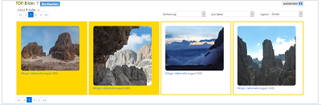
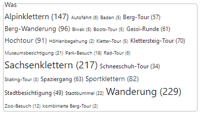
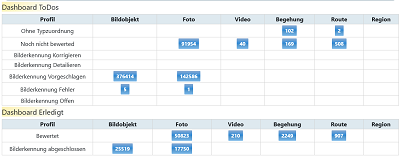
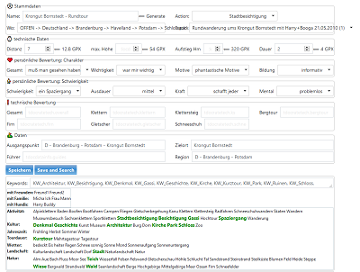
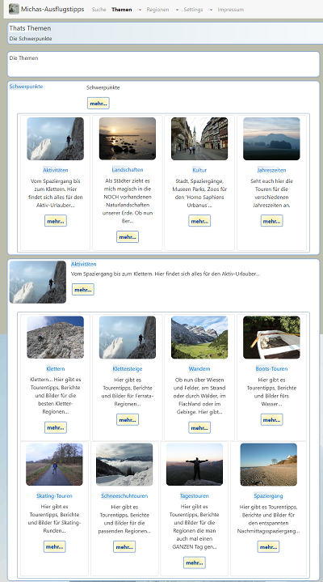

# MyCMS-Frontend-Commons

MyCMS is a library for developing CMS-applications.
It's the software-stack behind the new portal-version [www.michas-ausflugstipps.de](https://www.michas-ausflugstipps.de/). 

For more information take a look at documentation:
- [changelog](docs/CHANGELOG.md) 
- [credits for used libraries](docs/CREDITS.md)

MyCMS-Frontend-Commons contains the services+utils for the client-part of an application as browser-components and services.

Some amazing Features
- common angular-services, directives, pipes, components
    - service to render html/markdown into page
    - simple http-backend
    - render dynamic components into page
    - layout-control on layout-events
- common geo-services, maps, compontents
    - map-components leaflet-maps or geo-profile-maps
    -  services gpx+geojson-parser/generator
    - 
    - 
- common layout-styles
- CommonDoc-angular-modules
    - fully generic or abstract components as pages/forms/lists/tagclouds/dashboards/videoplayer/musikcplayer and many others
    - 
    - 
    - 
    - 
- PDocRecord-angular-modules
    - full components as pages/forms/lists and a full angular-module with common routes/resolver for a simple-page-application
    - 
    - simple configuration of pages in pdocs-de.json if you use the static PDocDataService.
```
{
 "pdocs": [
  {
   "id": "menu",
   "descMd": "Hauptmenü",
   "flgShowTopTen": false,
   "flgShowSearch": false,
   "heading": "Hauptmenü",
   "name": "Hauptmenü",
   "subSectionIds": "start,vita,roadmap",
   "teaser": "Hauptmenü",
   "type": "SectionOverviewPage"
  },
  {
   "id": "start",
   "descMd": "# Ieiunia non dempto\n\n## Quem in...",
   "flgShowTopTen": false,
   "flgShowNews": false,
   "flgShowSearch": false,
   "heading": "Thats MySimpleHomePage",
   "name": "Willkommen",
   "subSectionIds": "skills,me",
   "teaser": "Willkommen bei MySimpleHomePage",
   "type": "SectionOverviewPage"
  },
```
    
